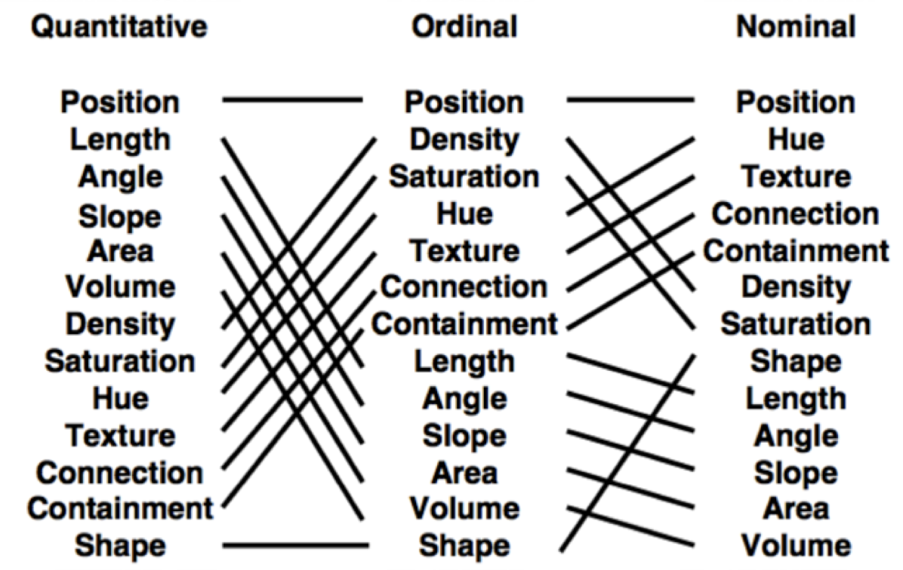

# Bar chart

## Visualization
Visualization Pipeline:

Data -> Filtering -> Mapping -> Rendering -> Graphic 

* data: scraping, simulation, observation..
* filtering: data cleaning, calculations, transformations..
* mapping: transform data into a graphical representation, Position, size, shape, color.. 
* rendering: positioning of geometries in space, x-y-Coordinates in charts or long-lat on maps
* graphic: graphic/video with or without interaction

### Visual Attributes



## d3.js
* JavaScript library for manipulating documents based on data
* uses HTML, SVG, and CSS
* de facto standard for visualizations

## Anatomy of Websites

```
<!DOCTYPE html>
<html lang="en">
<head>
    <meta charset="UTF-8">
    <title>Loading Datasets</title>

    <!-- if you use files for styles and javascript-->
    <link rel="stylesheet" href="main.css">
    <script src="javascriptfile.js"></script>

    <!-- styles inside html file-->
    <style>
        body{
            color: blue;
            background: grey;
        }
    </style>
</head>
<body>

<script type="text/javascript"> 
    // javascript here
</scrip>
</body>
</html>
```

For analysing your and any other website you should play around with the build in tools of your browser: Inspector and Console

## Anatomy of Charts
What we see:

* Bars (or lines, dots, areas)
* Axis with labels

The hidden magic:

* a canvas (svg or canvas) to draw on
* scaling for your data

## Logical order to program a bar chart
* define height, width and margins for your canvas
* add the canvas to your DOM, set a height and width for your canvas
* choose a scaling function - which scale fits your data, calc min/max of your data
* draw axis on the canvas
* draw bars or other primitives on the canvas
* add interaction and/or animations

## Add SVG to DOM
define your height, width and margins

    var margin = {top: 5, bottom: 20, left: 40, right: 7};
    var height = 200 - margin.top - margin.bottom;
    var width = 350 - margin.left - margin.right;

add svg to your dom-element and set height etc

    var svg = d3.select('body').append('svg')
        .attr('height', height + margin.top + margin.bottom)
        .attr('width', width + margin.left + margin.right)
        .append('g')
        .attr('transform', 'translate(' + margin.left + ',' + margin.top + ')');    

by adding a group (g) to the canvas, you can apply the margins. it works with the transforma attribute, which moves your drawing ground by x and y values

Another difference between what we see and how to programe, is the dimension of the svg (or canvas). We start on the top left corner (0,0) and go to the left (width) and down (height). 
A seen point on the bottom of the lower axis (for example point x: 5, y: 5) is actual x:5 but on the y axis something close to the height! 

## Scaling

Scaling is not the best word to descripe the process of map or translate a value from your dataset to one point on your screen
range: pixels on your screen
domain: min and max or categories of your dataset

    var x = d3.scaleBand()
        .rangeRound([0, width])
        .padding(0.1)
        .domain(data.map(function (d) {
            return d[0];
        }));   

## Axis

    svg.append('g')
        .attr('class', 'axis axis-y')
        .call(d3.axisLeft(y));

appending another group helps you organize your svg elements. d3.axisLeft is a standard function for a very default look and feel of axis. you can easy append further attributes to customize the axis

## Bars

    svg.selectAll('.bar')
        .data(data)
        .enter().append('rect')
        .attr('class', 'bar')
        .attr('x', function (d) {
            return x(d[0])
        })
        .attr('y', function (d) {
            return y(d[1])
        })
        .attr('width', x.bandwidth())
        .attr('height', function (d) {
            return height - y(d[1]);
        })
        .style('fill', 'blue');

the styling is now hardcoded. try to avoid this by using css
the example css for the bars would be

    .bar{
        fill: blue;
    }


## SVG Primitives
* Rectangles : `<rect>` - with x, y and width and height
* Circle:  `<circle>` - cx, cy, r
* Ellipse `<ellipse>` - cx, cy, rx, ry
* Line `<line>` - y1 x1, y2 x2
* Path `<path>` - d 

## Chaining
* means simplifying code by calling multiple functions of one object
* for example our rectangles from the bar chart
* after appending the rectangles, we say
    * give that bar an attribut: a css class `.attr('class', 'bar')`
    * start drawing this rectangle on position x  `.attr('x', function (d) {return x(d[0])})` 
    * and position y `.attr('y', function (d) {return y(d[1])})`
    * draw from position x the width `.attr('width', x.bandwidth())`
    * and from postion y the "negative" height `.attr('height', function (d) {return height - y(d[1]); })`
    * after all is drawn, make the rectangle blue `.style('fill', 'blue')`

## You learned today
* how to append a svg element to an element in your dom
* how to define a scaling function based on your svg dimension (width/height) and your data (min/max)
* how to draw axis
* how to draw rectangles
* anonymous function in JavaScript `function (d){return d.value;}`
* the magic of chains

## References
* [SVG Primitives](https://www.w3.org/TR/SVG/shapes.html)
* [Browser Developer Tools](https://developer.mozilla.org/en-US/docs/Learn/Common_questions/What_are_browser_developer_tools)
